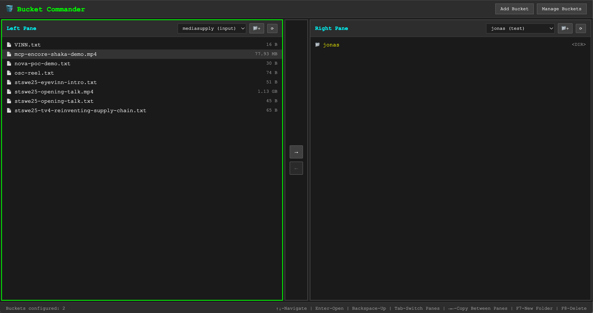

# 🪣 Bucket Commander

A Norton Commander-inspired dual-pane file manager for S3 buckets, built as a modern web application.

## Screenshot



*Norton Commander-inspired dual-pane interface for S3 bucket management*

## 🚀 Try It Now - No Installation Required!

**Available as a ready-to-use service**: [Launch Bucket Commander on Open Source Cloud](https://app.osaas.io/browse/birme-bucket-commander)

Skip the setup and start managing your S3 buckets immediately with our hosted version.

## Architecture

This application consists of two main components:

### Frontend (React + TypeScript)
- **Location**: `./` (root directory)
- **Port**: 5173 (development)
- **Technology**: React, TypeScript, Styled Components, Vite

### Backend (Node.js + Express)
- **Location**: `./backend/`
- **Port**: 3001
- **Technology**: Express, TypeScript, SQLite (better-sqlite3), AWS SDK v3

## Features

- ✅ **Dual-Pane Interface**: Norton Commander-inspired layout with left and right file panes
- ✅ **S3 Credential Management**: Securely store and manage AWS S3 credentials with session token support
- ✅ **Bucket Browsing**: Navigate through S3 buckets, folders, and files with keyboard navigation
- ✅ **File Operations**: S3-to-S3 copying via Open Source Cloud services with real-time job monitoring
- ✅ **Folder Management**: Create new folders with F7 shortcut
- ✅ **File Management**: Delete files/folders with F8 shortcut and confirmation
- ✅ **Connection Testing**: Validate credentials when adding/updating bucket configurations
- ✅ **Persistent Storage**: SQLite database for credential storage
- ✅ **Smart Persistence**: Local storage for pane selections with 6-hour expiration
- ✅ **Keyboard Navigation**: Full arrow key navigation, Enter to enter folders, Backspace to go up

## Getting Started

### Option 1: Docker Deployment (Recommended)

1. **Clone and Configure**
   ```bash
   git clone <repository-url>
   cd bucket-commander
   cp .env.example .env
   # Edit .env and set your OSC_ACCESS_TOKEN
   ```

2. **Run with Docker Compose**
   ```bash
   docker-compose up -d
   ```

3. **Access Application**
   - Frontend: http://localhost:3001
   - API: http://localhost:3001/api

#### Manual Docker Build
```bash
# Build image
docker build -t bucket-commander .

# Run with volume mounting
docker run -d \
  --name bucket-commander \
  -p 3001:3001 \
  -v bucket-commander-data:/app/data \
  -e OSC_ACCESS_TOKEN=your_token_here \
  bucket-commander
```

#### Environment Variables
| Variable | Description | Default | Required |
|----------|-------------|---------|----------|
| `OSC_ACCESS_TOKEN` | Open Source Cloud access token | - | Yes |
| `PORT` | Application port | `3001` | No |
| `DB_PATH` | Database directory | `/app/data` (Docker)<br>`~/.bucket-commander` (Local) | No |

### Option 2: Local Development

#### Prerequisites
- Node.js 18+ 
- npm or yarn

#### Installation & Development

1. **Install All Dependencies**
   ```bash
   npm run install:all
   ```

2. **Development Mode** (with hot reloading)
   ```bash
   npm run dev
   ```
   Both frontend and backend will run integrated on http://localhost:3001

   Alternative: Run frontend and backend separately:
   ```bash
   # Terminal 1 - Backend with hot reload
   npm run dev:backend
   
   # Terminal 2 - Frontend with hot reload  
   npm run dev:frontend
   ```

#### Production Build & Deployment

1. **Build Everything**
   ```bash
   npm run build
   ```

2. **Start Production Server**
   ```bash
   npm start
   ```
   Application runs on http://localhost:3001 (configurable with PORT env var)

## API Endpoints

### Credentials
- `GET /api/credentials` - List all credentials
- `POST /api/credentials` - Create new credential
- `GET /api/credentials/:id` - Get credential by ID
- `PUT /api/credentials/:id` - Update credential
- `DELETE /api/credentials/:id` - Delete credential

### S3 Operations
- `GET /api/s3/:credentialId/objects` - List objects in bucket
- `GET /api/s3/:credentialId/test` - Test connection
- `DELETE /api/s3/:credentialId/objects` - Delete object or folder
- `POST /api/s3/:credentialId/folders` - Create new folder

### OSC Operations
- `POST /api/osc/copy` - Start S3-to-S3 copy job via Open Source Cloud
- `GET /api/osc/jobs/:jobName` - Get job status and monitor progress

### Health Check
- `GET /api/health` - API health status

## Database

The application uses SQLite for persistent storage of S3 credentials. The database file is created at:
- **Docker**: `/app/data/bucket-commander.db` (mount volume for persistence)
- **Local**: `~/.bucket-commander/bucket-commander.db` (or custom path via `DB_PATH` env var)

For Docker deployments, use a volume to persist data:
```bash
# Named volume (recommended)
docker run -v bucket-commander-data:/app/data bucket-commander

# Bind mount to host directory
docker run -v /host/path/to/data:/app/data bucket-commander
```

## Keyboard Shortcuts

- **Arrow Keys**: Navigate through files and folders
- **Enter**: Enter selected folder or focus on item
- **Backspace**: Go up one directory level
- **Tab**: Switch between left and right panes
- **F7**: Create new folder in current directory
- **F8**: Delete selected file or folder (with confirmation)
- **Ctrl+C**: Copy selected file/folder to opposite pane

## Usage Guide

### Adding S3 Credentials
1. Click "Add Bucket" to open the credential form
2. Fill in your S3 credentials:
   - **Alias**: Friendly name for the connection
   - **Bucket**: S3 bucket name
   - **Region**: AWS region (e.g., us-east-1)
   - **Access Key ID**: Your AWS access key
   - **Secret Access Key**: Your AWS secret key
   - **Session Token**: (Optional) For temporary credentials
   - **Endpoint**: (Optional) For S3-compatible services like MinIO or DigitalOcean Spaces

### File Operations
- **Copy**: Select a file/folder and click the copy button (→ or ←) or use Ctrl+C
- **Delete**: Select a file/folder and press F8 for deletion with confirmation
- **Create Folder**: Press F7 to create a new folder in the current directory
- **Navigate**: Use arrow keys to move through the file list, Enter to open folders

### Copy Job Monitoring
When copying files between S3 buckets, the application uses Open Source Cloud services:
- Real-time job status updates
- Progress monitoring with automatic polling
- Support for both file-to-file and file-to-folder copying
- Intelligent destination path handling

## Future Enhancements

- File preview functionality
- Bulk operations
- Search and filtering
- Additional keyboard shortcuts (F1-F6, F9-F10 functions)
- File size and modification date display

## Security Notes

- Credentials are stored locally in SQLite
- All S3 operations go through the backend API
- No credentials are sent to the frontend
- CORS is configured for local development